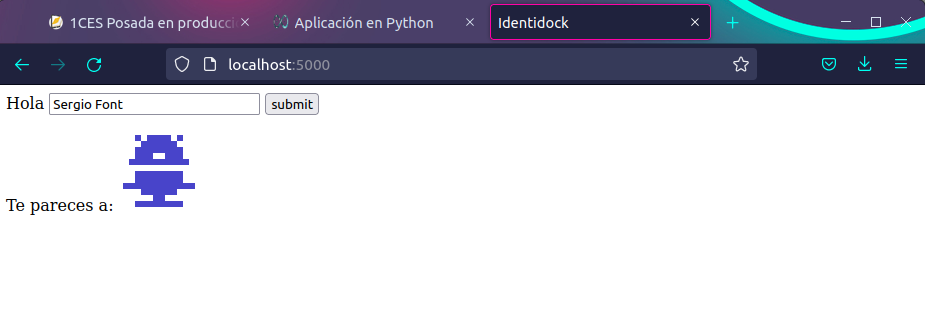
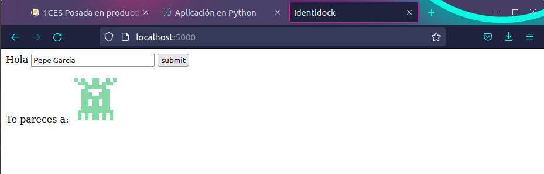
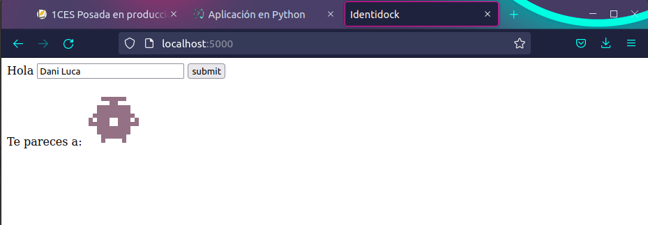

# Práctica Aplicación Python


Creamos el contenido de Dockerfile

```dockerfile
FROM python:3.4
RUN pip install Flask==0.10.1
WORKDIR /app
COPY app /app
CMD ["python", "identidock.py"]
```
y de identidock.py

```bash
from flask import Flask
app = Flask(__name__)

@app.route('/')
def hello_world():
    return 'Hello World!\n'

if __name__ == '__main__':
    app.run(debug=True, host='0.0.0.0')
```
Hacemos un curl localhost:5000

Reemplazaremos el contenido del identidock por el siguiente:

```bash
from flask import Flask
app = Flask(__name__)
default_name = 'Víctor Ponz'
@app.route('/')
def get_identicon():
	name = default_name
	header = '<html><head><title>Identidock</title></head><body>'
	body = '''<form method="POST">
			Hola <input type="text" name="name" value="{}">
			<input type="submit" value="submit">
			</form>
			<p>Te pareces a:
			
			'''.format(name)
	footer = '</body></html>'
	return header + body + footer
if __name__ == '__main__':
	app.run(debug=True, host='0.0.0.0')
```

Nos aparecerá la el "mini formulario" pero sin ninguna imagen. Modificamos el Dockerfile con lo siguiente:

```bash
FROM python:3.4
RUN pip install Flask==0.10.1 requests==2.5.1
WORKDIR /app
COPY app /app
CMD ["python", "identidock.py"]
```

Iniciamos el Docker de dnmoster con:

```dockerfile
docker run -d --name dnmonster amouat/dnmonster:1.0
```

Lo conectamos con dnmonster al puerto 8000

```dockerfile
docker run -d -p 5000:5000 -v "$(pwd)"/app:/app --link dnmonster:dnmonster identidock
```

A continuación creamos una snapshot del actual estado del docker

```bash
git add *
git commit -m v2.1
git tag v2.1
git push origin v2.1
```

Creamos un docker-compose.yml:

```yaml
identidock:
  build: .
  ports:
    - "5000:5000"
  volumes:
    - ./app:/app
  links:
    - dnmonster
dnmonster:
  ports:
    - "5080:8080"
  image: amouat/dnmonster:1.0
```

Volvemos al fichero identidock y lo sustituimos por lo siguiente:

```bash
from flask import Flask, Response, request
import requests
import hashlib
app = Flask(__name__)
salt = "UNIQUE_SALT"
default_name = 'Víctor Ponz'

@app.route('/', methods=['GET', 'POST'])
def mainpage():
	name = default_name
	if request.method == 'POST':
		name = request.form['name']
	salted_name = salt + name
	name_hash = hashlib.sha256(salted_name.encode()).hexdigest()
	header = '<html><head><title>Identidock</title></head><body>'
	body = '''<form method="POST">
			Hola <input type="text" name="name" value="{0}">
			<input type="submit" value="submit">
			</form>
			<p>Te pareces a:
			
			'''.format(name, name_hash)
	footer = '</body></html>'
	
	return header + body + footer
@app.route('/monster/<name>')
def get_identicon(name):
	r = requests.get('http://dnmonster:8080/monster/' + name + '?size=80')
	image = r.content
	return Response(image, mimetype='image/png')
	
if __name__ == '__main__':
	app.run(debug=True, host='0.0.0.0')
```

Fusionamos  la rama identicons con "master" o "main" (en mi caso main)

```bash
git add *
git commit -m "Finalizar identicons"
git checkout main
git merge identicons
git branch -d identicons
git push
git tag v2.2
git push origin v2.2
```

A continuación almacenaremos en caché el resultado, para que no tenga que llamar al servicio dnmonster constantemente:

Modificamos el docker-compose.yml

```yaml
identidock:
  build: .
  ports:
    - "5000:5000"
  volumes:
    - ./app:/app
  links:
    - dnmonster
    - redis
dnmonster:
  ports:
    - "5080:8080"
  image: amouat/dnmonster:1.0
redis:
  image: redis:3.0
```

Lo mismo para el Dockerfile

```bash
FROM python:3.4
RUN pip install Flask==0.10.1 requests==2.5.1 redis==2.10.3
WORKDIR /app
COPY app /app
CMD ["python", "identidock.py"]
```

Añadimos el siguiente contenido al identidock, con la diferencia de que esta vez llamamos a la imagen redis insertada en el docker-compose.yml

```bash
from flask import Flask, Response, request
import requests
import hashlib
import redis

app = Flask(__name__)
cache = redis.StrictRedis(host = 'redis', port = 6379, db = 0)
salt = "UNIQUE_SALT"
default_name = 'Víctor Ponz'

@app.route('/', methods=['GET', 'POST'])
def mainpage():
	name = default_name
	if request.method == 'POST':
		name = request.form['name']
	salted_name = salt + name
	name_hash = hashlib.sha256(salted_name.encode()).hexdigest()
	header = '<html><head><title>Identidock</title></head><body>'
	body = '''<form method="POST">
			Hola <input type="text" name="name" value="{0}">
			<input type="submit" value="submit">
			</form>
			<p>Te pareces a:
			
			'''.format(name, name_hash)
	footer = '</body></html>'
	
	return header + body + footer
@app.route('/monster/<name>')
def get_identicon(name):
	image = cache.get(name)
	if image is None:
		print ("Cache miss", flush=True)
		r = requests.get('http://dnmonster:8080/monster/' + name + '?size=80')
		image = r.content
		cache.set(name, image)
	return Response(image, mimetype='image/png')
		
if __name__ == '__main__':
	app.run(debug=True, host='0.0.0.0')
```

Para actualizar el docker y que funcione deberemos hacer:

```dockerfile
docker-compose stop
docker-compose build
docker-compose up -d
```

Comprobación funcionamiento conmigo mismo.



Comprobación funcionamiento con alguien aleatorio.



Comprobación funcionamiento con un compañero.


