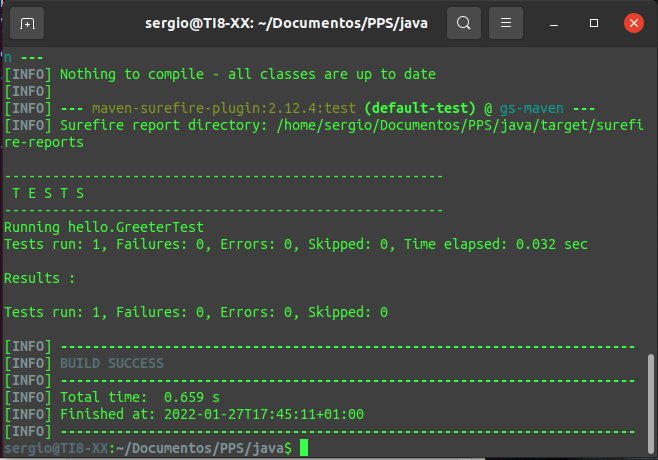

# Práctica Maven


## Configuración del proyecto

Creamos la estructura para la contrucción en Maven

```dockerfile
└── src
    └── main
        └── java
            └── hello
```
Dentro de /src/main/java/hello creamos el archivo HelloWorld.java

```java
package hello;

public class HelloWorld {
  public static void main(String[] args) {
    Greeter greeter = new Greeter();
    System.out.println(greeter.sayHello());
  }
}
```
y un fichero Greeter.java

```java
package hello;

public class Greeter {
  public String sayHello() {
    return "Hello world!";
  }
}
```

## Construir código java

Probamos la instalación con el comando: mvn -n

En la raíz del proyecto crearemos un archivo pom.xml con el siguiente contenido

```xml
<?xml version="1.0" encoding="UTF-8"?>
<project xmlns="http://maven.apache.org/POM/4.0.0" xmlns:xsi="http://www.w3.org/2001/XMLSchema-instance"
    xsi:schemaLocation="http://maven.apache.org/POM/4.0.0 https://maven.apache.org/xsd/maven-4.0.0.xsd">
    <modelVersion>4.0.0</modelVersion>

    <groupId>org.springframework</groupId>
    <artifactId>gs-maven</artifactId>
    <packaging>jar</packaging>
    <version>0.1.0</version>

    <properties>
        <maven.compiler.source>1.8</maven.compiler.source>
        <maven.compiler.target>1.8</maven.compiler.target>
    </properties>

    <build>
        <plugins>
            <plugin>
                <groupId>org.apache.maven.plugins</groupId>
                <artifactId>maven-shade-plugin</artifactId>
                <version>3.2.4</version>
                <executions>
                    <execution>
                        <phase>package</phase>
                        <goals>
                            <goal>shade</goal>
                        </goals>
                        <configuration>
                            <transformers>
                                <transformer
                                    implementation="org.apache.maven.plugins.shade.resource.ManifestResourceTransformer">
                                    <mainClass>hello.HelloWorld</mainClass>
                                </transformer>
                            </transformers>
                        </configuration>
                    </execution>
                </executions>
            </plugin>
        </plugins>
    </build>
</project>
```

Ejecutamos la orden para la compilación

```dockerfile
mvn compile
```

Compilamos el paquete con código Java

```dockerfile
mvn package
```

A continuación cambiaremos el contenido de HelloWorld.java

```java
package hello;

import org.joda.time.LocalTime;

public class HelloWorld {
  public static void main(String[] args) {
    LocalTime currentTime = new LocalTime();
    System.out.println("The current local time is: " + currentTime);
    Greeter greeter = new Greeter();
    System.out.println(greeter.sayHello());
  }
}
```

Añadimos las siguientes líneas al código pam.xml

```xml
<dependencies>
		<dependency>
			<groupId>joda-time</groupId>
			<artifactId>joda-time</artifactId>
			<version>2.9.2</version>
		</dependency>
</dependencies>
```

Volvemos al fichero identidock y lo sustituimos por lo siguiente:

```java
package hello;

import static org.hamcrest.CoreMatchers.containsString;
import static org.junit.Assert.*;

import org.junit.Test;

public class GreeterTest {
  
  private Greeter greeter = new Greeter();

  @Test
  public void greeterSaysHello() {
    assertThat(greeter.sayHello(), containsString("Hello"));
  }

}
```

Añadimos la dependencia hamcrest

```xml
<dependency>
    <groupId>org.hamcrest</groupId>
    <artifactId>hamcrest-all</artifactId>
    <version>1.3</version>
    <scope>test</scope>
</dependency>
```

Volvemos a ejecutar mvn test

Y aquí mostramos la captura de que se ha ejecutado el test de forma correcta.


